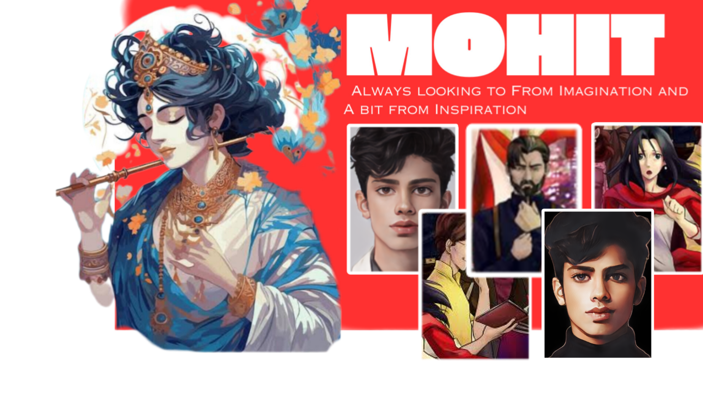

<!-- My Readme Profile!
I have spent a lot of time to make my Readme, and if you like it feel free to take inspiration!

**Acknowledgements**
Awesome Readme Templates
Awesome README
How to write a Good readme

**Authors**
@imohitpatel

**Deployment**
Creating a README on GitHub is a simple process. Here are the steps:

Click the "Create new file" button located in a new github repository (your username).

In the "Name your file" field, enter "README.md" (without the quotes).

Feel free to copy and paste anything you liked from my readme (Customizing it to fit your own theme and stats)

Once you've added all the content, scroll to the bottom of the page and click the "Commit new file" button.

Your README will now be visible on the main page of your repository! -->

<!--Changing text in different languages-->

<!--blue striking border-->

<!--hero banner -->

<!-- Social Media link with icons-->

<!--youtube-->
  
  &#8287;&#8287;&#8287;&#8287;&#8287;<!--twitter-->
  
  &#8287;&#8287;&#8287;&#8287;&#8287;<!--discord-->
  
  &#8287;&#8287;&#8287;&#8287;&#8287;<!--dev community medium-->
  
  &#8287;&#8287;&#8287;&#8287;&#8287;<!--buy me coffee-->
  
  &#8287;&#8287;&#8287;&#8287;&#8287;<!--patreon-->
  

<h3>Technical way to communicate by</h3>

###
<!--Language framework from skillicons.dev-->

  <a href="#"><!--add your stack and software-->
    
  </a>

    

<h2></h2> <!-- for light divider line-->
<!--night time gif -->

 
   

<!--changing text-->

    

###
<!--badges-->
<h3 align="left">🏆Achievement badges</h3>

###
<!--My stats-->
<h3 align="left">🔥 My Stats</h3>

<h2></h2> <!-- for light divider line-->

  
  

## 🏆 GitHub Trophies

---

<!-- your thoughts -->

 
If 💙 , Good to express as ⭐ and Share it with fellow Developer!

  ---
  
<!-- memes of Rock-->
<h1 align='right'>⚡️<i>Just Rock!</i>⚡️</h1>

<!-- coding mode -->
<h1 align=left >Code Cycle</h1>

&nbsp;&nbsp;&nbsp;&nbsp;&nbsp;<!-- headache, debugging-->

&nbsp;&nbsp;&nbsp;&nbsp;&nbsp;<!-- normal ,Lightsmile -->

<!-- happy and shocked -->
